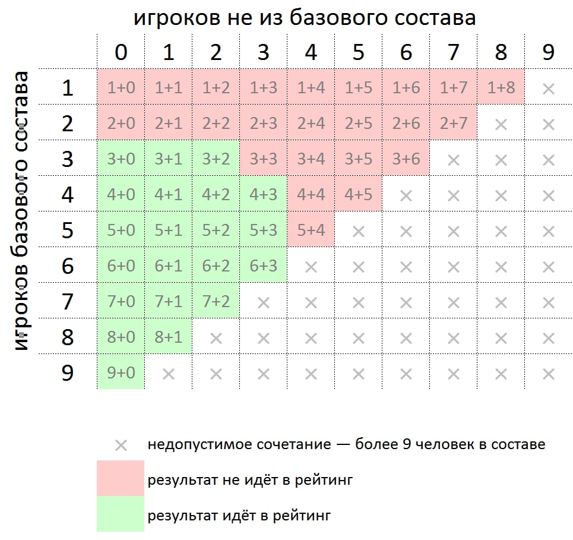

# Что за базовые составы и зачем они нужны?

Базовый состав (БС) — это список игроков, которые играют в команде на постоянной основе. Он используется для расчёта [командного рейтинга](https://rating.maii.li/b/), который ведёт [Международная ассоциация интеллектуальных игр](https://maii.li/p/about) (МАИИ). Именно этот рейтинг отображается на турнирном сайте. Правила расчёта рейтинга можно посмотреть в [Положении об эгиде и рейтинге](https://www.maii.li/p/aegis-rating#a), правила преемственности описаны там же, а в картинке ниже показаны более наглядно. 

Всего в базовом составе может быть до 9 человек. В течение сезона можно один раз перейти из одного БС в другой. 

Если вы хотите, чтобы результаты вашей команды учитывались в этом рейтинге, — например, чтобы отслеживать свой прогресс, — вашей команде нужно ввести базовый состав на сезон. Это можно сделать как сейчас, так и в течение сезона (до 1 августа 2025 года невключительно).

Кроме того, своевременный ввод базовых составов облегчает жизнь представителям — тем, кто вводит ваши результаты на турнирный сайт, так что мы рекомендуем вам это сделать.
